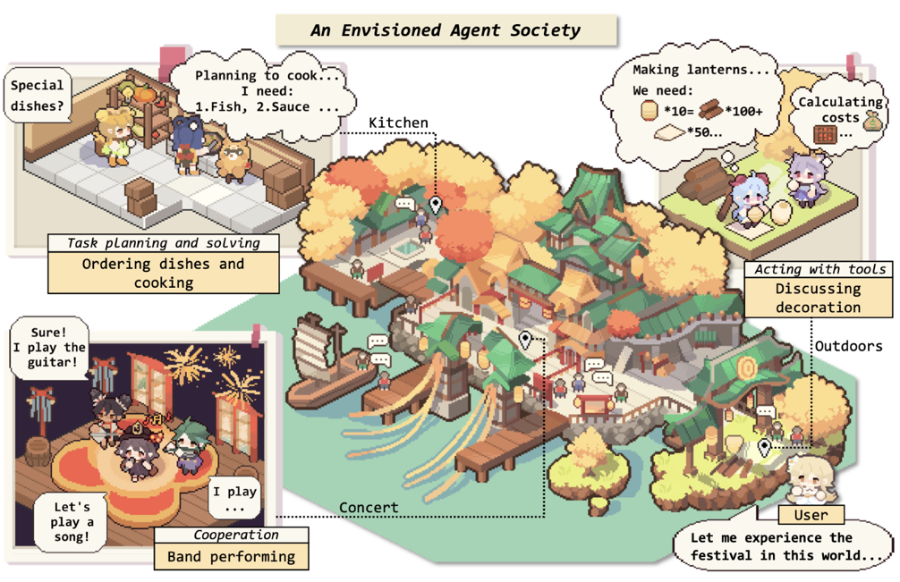

# Slay-gent: Weather-Based Outfit Assistant
This website suggests what to wear based on the weather in your city!
## 🤓 Authors:  
Leah Pak ([GitHub](https://github.com/Leahdotcom) |  [LinkedIn](https://www.linkedin.com/in/leah-pak)) 

Quentin Phillips ([GitHub](https://github.com/QuentinPhil) | [LinkedIn](https://www.linkedin.com/in/quentin-phillips-01b95215/)) 

Molly McDade ([GitHub](https://github.com/mtmcdade) | [LinkedIn](https://www.linkedin.com/in/molly-mcdade111/))

## 📋 Project Scope: 
	 This website suggests what to wear based on the weather in your city. You can choose between men's or women's clothing styles with a simple toggle button. You type in your location, and it uses the OpenWeatherMap API to get current temperature, conditions, humidity, and wind speed. Then it sends this weather data to the Groq AI API to generate personalized outfit recommendations that match the conditions. The AI creates detailed descriptions of four clothing items (shirt, pants, shoes, and an accessory) and also generates an image prompt that's sent to Pollinations.ai to create a visual representation of the outfit. Finally, a shopping link for each clothing item is generated by taking the name of the recommended piece and creating a simple Amazon search URL, making it easy to find and purchase similar items.     
## ✨ Project Inspiration: 

	This project was inspired by the website Daily Dress Me, which is a platform that depicts outfit inspiration based on a user's IP address. The main inspiration for our project was that this website has 3 key areas it could improve upon: 1) options for men's styling 2) more detailed weather information and 3) easy links to purchase clothing items shown. 
	We tried to improve upon these three concepts in our design. While all three concepts were accomplished, the "style" of our outfits does not output fits as fashionable as those on Daily Dress Me. Additionally, Daily Dress Me has a cleaner visualization of the outfits that likely pulls from real website photos, rather than AI image generation. We will continue to work on the features in our model to achieve better visual and stylistic presentations in the future. However, we are satisfied that for now our website allows for more inclusive styling and an avenue to shop the look. 
 
## 🔎 Project Details: 
 
## 🦾 Claude Prompt: 
This website was created using HTML, CSS, and JavaScript code generated by Claude. Below is the prompt that Claude was given to create this code: 
"Create a complete HTML file for a web application called 'Slay-gent' that recommends outfits based on the current weather in a user's city. The app should: 
Let users input their city name with autocomplete suggestions 
Fetch real-time weather data using OpenWeatherMap API 
Generate fashion recommendations using Groq's AI API based on current temperature and conditions 
Toggle between men's and women's clothing styles 
Display an outfit image visualization using Pollinations.ai 
Provide Amazon shopping links for each recommended item 
Include error handling and a loading indicator 
Be designed to run directly from GitHub Pages without requiring a backend server 
Please provide the full HTML, CSS, and JavaScript code in a single file." 
##  📖  Case Study:  

 The Rise and Potential of Large Language Model Based Agents: A Survey   
## 💡 What's Next: 
## 🤝 Responsible AI Considerations: 
## 📕 Reference List:
